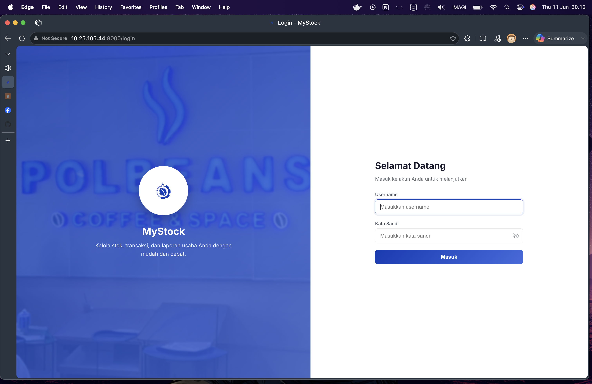
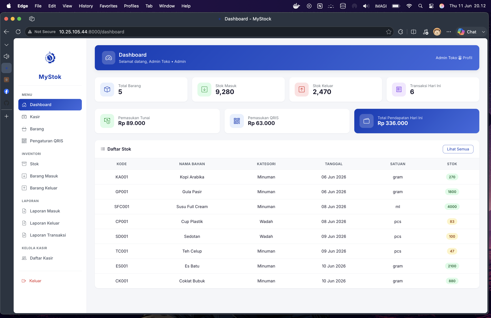
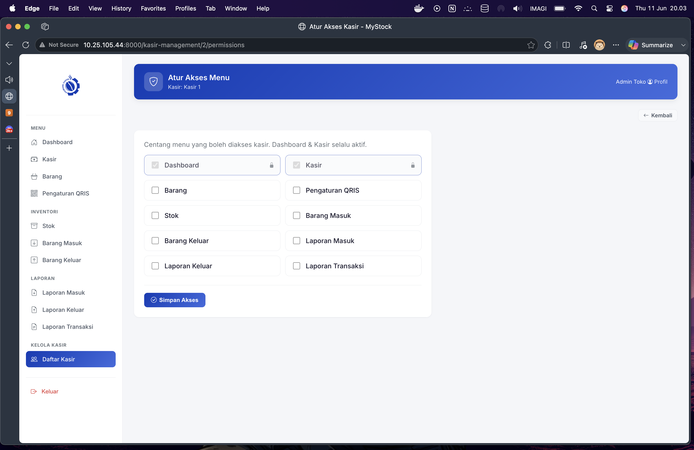

# MyStok — Web Dashboard

Sistem manajemen stok, kasir, dan laporan untuk usaha kecil/menengah (kedai kopi, restoran, dll). Dibangun dengan **Laravel 10** + **Bootstrap 5** + **Custom CSS**.

## Fitur

### Admin
- Dashboard dengan statistik (total barang, stok masuk/keluar, transaksi hari ini, pendapatan tunai/QRIS)
- Kasir (POS) — pilih menu, atur qty, pilih metode pembayaran (Tunai/QRIS)
- CRUD Barang/Produk + Bahan Baku (ingredient)
- Manajemen Stok (barang masuk, barang keluar)
- Pengaturan QRIS (upload foto QR untuk pembayaran)
- Laporan (Barang Masuk, Barang Keluar, Transaksi per hari + breakdown Tunai vs QRIS)
- Kelola Kasir (CRUD akun, atur akses menu via checkbox, jadwal kerja, riwayat penjualan)
- Profile pengguna

### Kasir
- Dashboard (ringkasan)
- Kasir (POS) — transaksi penjualan
- Akses menu dinamis (diatur admin via checkbox permission)

## Tech Stack

| Layer | Teknologi |
|-------|-----------|
| Backend | Laravel 10 (PHP 8.x) |
| Database | MySQL |
| Auth API | Laravel Sanctum |
| Frontend Web | Blade + Custom CSS (Inter font, responsive) |
| Icons | Bootstrap Icons |

## Instalasi

```bash
# Clone repository
git clone https://github.com/BimaFdilana/My-Stok-Web-Dashboard-V1.git
cd My-Stok-Web-Dashboard-V1

# Install dependencies
composer install

# Copy env dan generate key
cp .env.example .env
php artisan key:generate

# Konfigurasi database di .env
# DB_DATABASE=mystock
# DB_USERNAME=root
# DB_PASSWORD=

# Jalankan migrasi + seeder
php artisan migrate:fresh --seed

# Buat symlink storage
php artisan storage:link

# Jalankan server
php artisan serve
```

## Akun Default (Seeder)

| Role | Username | Password |
|------|----------|----------|
| Admin | `admin` | `password123` |
| Kasir | `kasir1` | `password123` |

## Screenshot

### Login


### Dashboard Admin


### Kelola Kasir — Atur Akses Menu


<!-- Tambahkan screenshot lain di sini:


-->

## Struktur Folder Penting

```
app/
├── Http/Controllers/
│   ├── Api/                    # API controllers (Auth, Kasir, Laporan, QRIS)
│   ├── DashboardController.php
│   ├── KasirManagementController.php
│   ├── TransactionController.php
│   └── ...
├── Models/
│   ├── User.php (HasApiTokens, role, permissions)
│   ├── Transaction.php (payment_method)
│   ├── QrisSetting.php
│   ├── KasirPermission.php
│   ├── KasirSchedule.php
│   └── ...
resources/views/
├── layouts/                   # Layout induk (app.blade, auth.blade)
├── components/                # Sidebar, Appbar (reusable)
├── auth/                      # Login, Register, Dashboard
├── kasir/                     # POS, Summary, Struk
├── kasir-management/          # Kelola Kasir (CRUD, Permission, Schedule)
├── produk/                    # CRUD Produk
├── stocks/                    # Stok
├── barangmasuk/               # Barang Masuk
├── barangkeluar/              # Barang Keluar
├── laporanmasuk/              # Laporan Masuk
├── laporankeluar/             # Laporan Keluar
├── laporantransaksi/          # Laporan Transaksi
├── qris/                      # Pengaturan QRIS
└── profile/                   # Profile User
public/css/
└── app.css                    # Single CSS file (variables, components, responsive)
```

## API Endpoints (untuk Flutter mobile)

| Method | Endpoint | Keterangan |
|--------|----------|-----------|
| POST | `/api/login` | Login + return token |
| POST | `/api/register` | Register |
| POST | `/api/logout` | Logout (revoke token) |
| GET | `/api/dashboard` | Dashboard stats |
| GET | `/api/items` | List produk |
| GET | `/api/kasir/items` | Menu kasir |
| POST | `/api/kasir/checkout` | Checkout transaksi |
| GET | `/api/kasir/receipt/{id}` | Detail struk |
| GET | `/api/laporan/barang-masuk` | Laporan masuk (filter tanggal) |
| GET | `/api/laporan/barang-keluar` | Laporan keluar (filter tanggal) |
| GET | `/api/laporan/transaksi` | Laporan transaksi per hari |
| GET | `/api/qris/active` | QRIS aktif |

## Lisensi

Private — untuk keperluan akademik.
